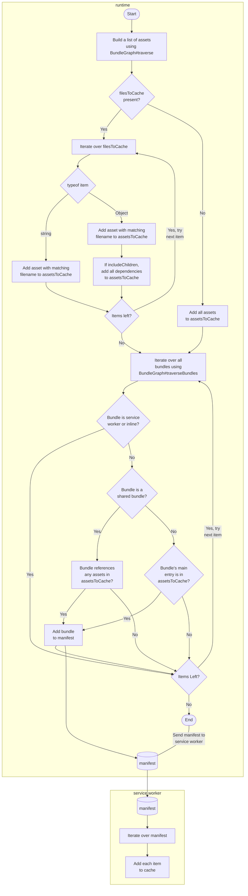

# parcel-custom-service-worker

A simple plugin that allows you to customize the resources cached in a [service worker bundled by Parcel](https://parceljs.org/languages/javascript/#service-workers).

## Installation

To get started, install the `parcel-plugin-custom-service-worker` NPM package.

```bash
npm install parcel-plugin-custom-service-worker
```

It includes `parcel-runtime-custom-service-worker` as a dependency, so you don't need to install it separately.

Make sure to add the runtime to your `.parcelrc` file.

```json
{
  "extends": "@parcel/config-default",
  "runtimes": ["parcel-runtime-custom-service-worker", "..."]
}
```

## Configuration

Create a `.service-worker-rc` in your project root. This file is a JSON file that contains the configuration for the service worker.

It contains a single property, `filesToCache`, which is an array of strings and objects.

> ⚠️ **Warning**: If the `filesToCache` property is not present, the plugin cache **all files**.

**Example**:
```jsonc
{
  "filesToCache": [
    "src/random-file.js",
    { "file": "src/my-page.html", "includeChildren": true }
  ]
}
```

This will cache the `random-file.js` file and the `my-page.html` file, as well as all of its dependencies.

> _Want more examples? Check out the [tests](./tests) folder._
>
> _I've documented the [simple](./tests/simple) and [exact](./tests/exact) test cases._
> _PRs are welcome for documentation and more examples!_


## Usage

To use the plugin, simply import `parcel-plugin-custom-service-worker` instead of `@parcel/service-worker` in your service worker.

```js
import { manifest, version } from 'parcel-plugin-custom-service-worker';

async function install() {
  const cache = await caches.open(version);
  await cache.addAll(manifest);
}
addEventListener('install', e => e.waitUntil(install()));

async function activate() {
  const keys = await caches.keys();
  await Promise.all(
    keys.map(key => key !== version && caches.delete(key))
  );
}
addEventListener('activate', e => e.waitUntil(activate()));
```

---

## How it works

